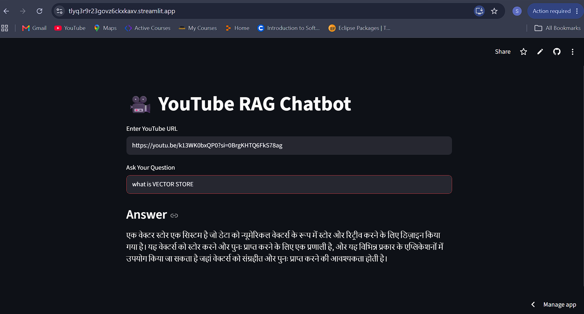

## 🌐 Live Demo

https://tlyq3r9r23govz6ckxkaxv.streamlit.app/
# 🎥 YouTube RAG Chatbot

A Retrieval-Augmented Generation (RAG) chatbot built using LangChain, Hugging Face Embeddings, FAISS, Groq LLM, and Streamlit. This application allows users to ask questions about any YouTube video by simply providing the video URL.
## 📸 Project Screenshot



## 🚀 Features

- Extracts YouTube video transcripts
- Supports English and Hindi transcripts
- Splits transcript into chunks
- Generates embeddings using Hugging Face
- Stores embeddings in FAISS Vector Database
- Retrieves relevant context using RAG
- Answers questions using Groq LLM
- Simple Streamlit user interface

## 🛠️ Tech Stack

- Python
- Streamlit
- LangChain
- Hugging Face Embeddings
- FAISS
- Groq API
- YouTube Transcript API

## 📂 Project Structure

```
app.py
streamlit_app.py
requirements.txt
README.md
.gitignore
```

## ▶️ Installation

```bash
git clone https://github.com/sachintiwari93/youtube_RAG_Chatbot
cd YouTube-RAG-Chatbot
pip install -r requirements.txt
streamlit run streamlit_app.py
```

## 📸 Output

- Enter YouTube URL
- Ask questions about the video
- Get AI-generated answers based on video transcript

## 👨‍💻 Author

**Sachin Tiwari**

GitHub: https://github.com/sachintiwari93
